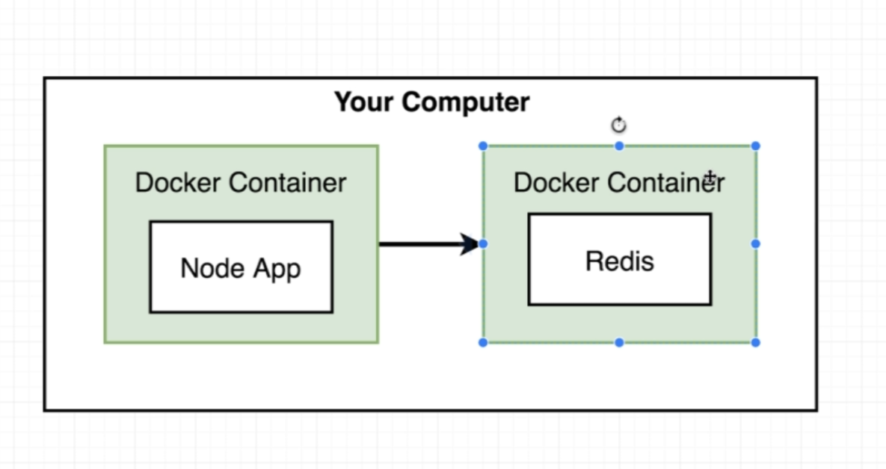

# complex

Данное приложение вычисляет число Фиббоначи.

  Рассмотрим специально усложненную архитектуру приложения.

Так выглядит само приложение, видим, что в Postgres хранятся одни значения, а в Redis - другие.

Когда пользователь нажимает Submit происходит следующее:. Пользовательнажимет кнопку React App делает API-запрос к Express серверу. Express сервер смотрит какое число ему передали и записывает его в Postgres, также это число передается в Redis. При поступлении нового числа в Redis вызывается Worker, который считает значение Фиббоначи и обратно возвращает резлуьтат в Redis.

