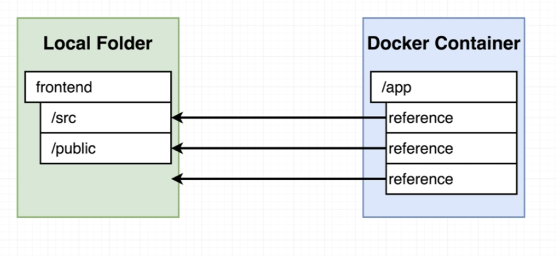

# workflow-frontend

Данный проект включает в себя все стадии разработки проекта.

Создаем пустой React проект, используя команду `create-react-app workflow-frontend .`

Пишем Dockerfile.dev для разворачивания приложения в dev среде. Запускаем `docker build -f` `Dockerfile.dev .` После того как запустили эту команду, начинают скачивать зависимости из package.json. Зависимости ставятся в контейнер и скачиваются в директорию в папку node\_modules. В dev зоне она нам не нужна, можем просто удалить. Контейнер после этого собирается также быстро. \(?\)

Можем запустить наш контейнер.

 `docker run -p 3000:3000 ae99c176964c`

 Всё работает, но, если мы будем менять наш App.js то эффекта не будет, нужно пересобирать контейнер, т.к. в Dockerfile когда мы делаем COPY делается снепшот текущего состояния файлов. То что мы меняем после не применяется.

Если мы не сделаем первый volume и запустим так, то  `docker run -p 3000:3000 -v $(pwd):/app ae99c176964c` вылезет ошибка, тк мы удалили директорию node\_modules и получается так, что ссылки нет.

Правильная команда \(т.е. если мы не указываем ничего через ":", то это значит что не стоит искать ссылки на этот объект в локальной директории: `docker run -p 3000:3000 -v /app/node_modules -v $(pwd):/app ae99c176964c` 

Для большего удобства разобьем эту команду и перенесем в `docker-compose.yml` 

Теперь чтобы запустить сервис, используем `docker-compose up.`

